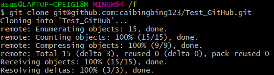
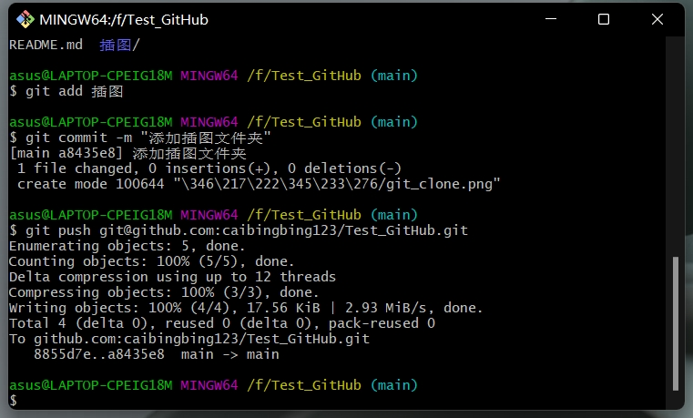
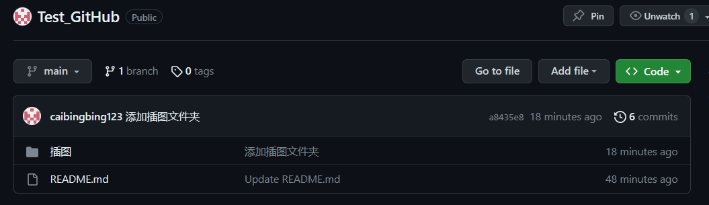

# Test_GitHub
创建github仓库及配置

参考

1、https://zhuanlan.zhihu.com/p/23167699

2、https://blog.csdn.net/qq_44722674/article/details/117200397

一、创建仓库（New repository）

二、配置本地 Git Bash

参考前面链接

三、仓库管理

1、本地克隆：git clone 仓库位置

2、添加文件并上传：git add files ，git commit -m "描述" ， git push 仓库位置。

添加成功

3、文件更改更新上传：

